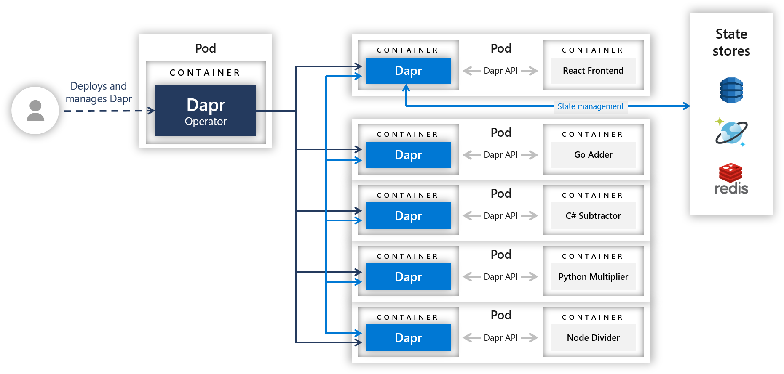
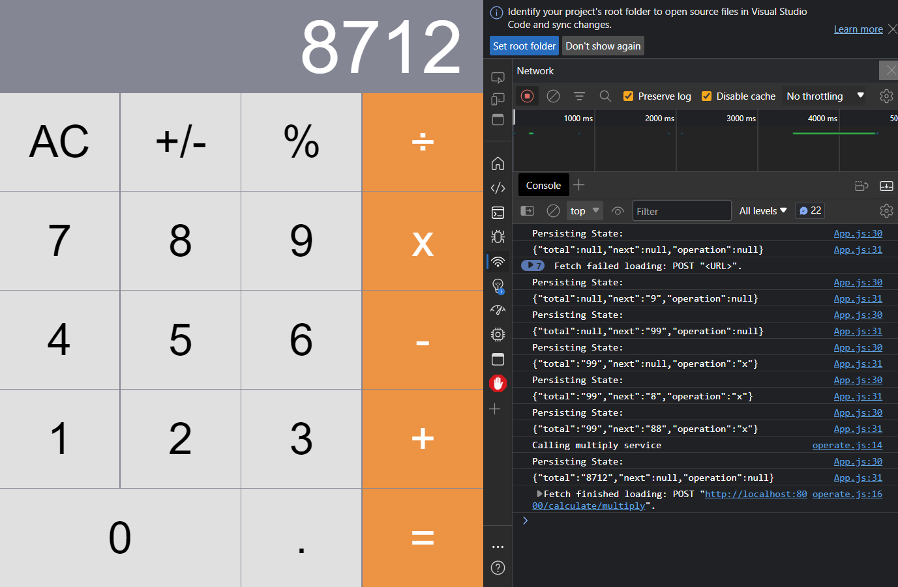
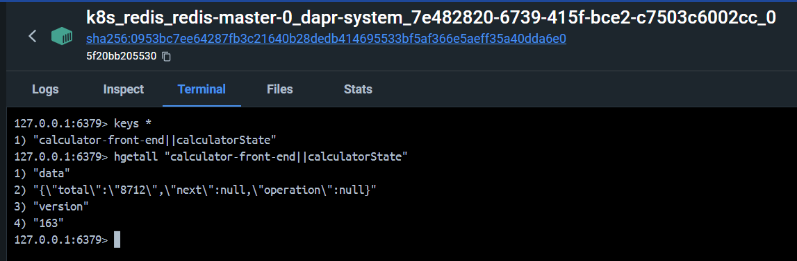
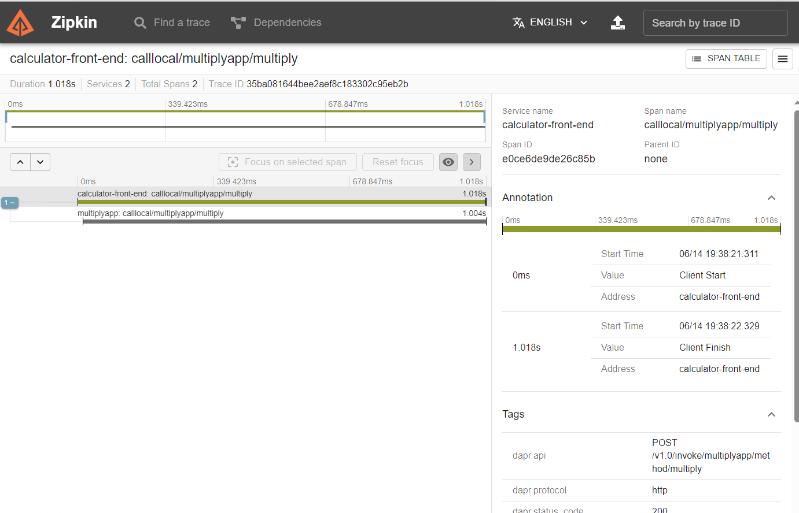

# Dapr

## Introduction

## Demo Part2 - k8s

### Architecure

### Demo

### State(Redis)

### Tracing

### K8s pods

## Service Mesh V.S. Dapr

Both dapr and service mesh(istio) follow a side-car archeticture, and they offer some overlapping capabilities. but Dapr is not a service mesh. 

| Service Mesh(Istio) | Multi-Runtime/Mecha(Dapr) |
|----|----|
| Focus on network | building blocks for distributed application |
| Infrastructure centric. Provide network communication between services | Developer centric. Provide abstraction/API for building blocks |
| Proxy: Forward traffic as native protocol | Adaptor: hide a variety of native protocol |
| Zero invasion. Applicable to cloud/k8s | Cloud/platform-agnostic(supports VMs/Cloud/K8s/mix), portable. Application depends on Dapr Api/Sdk solely |

As Service Mesh and Dapr works at a different level, both can work together in the same application. For example, a service mesh could provide networking communication between services. Dapr could provide application services such as state management or actor services.

## Challenge

Currently, dapr binary and sdk is not available in firm.

It's quite diffcult to maintain portability of dapr API while provide a rich feature that cover every scenario. So, in some case, we have to extend dapr in some way(request meta, extend dapr component)
