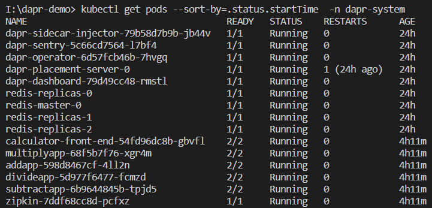

# Dapr

## Introduction

## Demo Part2 - k8s

### Architecure


### Config


#### app config

```yaml
apiVersion: dapr.io/v1alpha1
kind: Configuration
metadata:
  name: appconfig
  namespace: dapr-system
spec:
  tracing:
    samplingRate: "1"
    zipkin:
      endpointAddress: "http://zipkin.dapr-system.svc.cluster.local:9411/api/v2/spans"
```

#### multiply app

```yaml
apiVersion: apps/v1
kind: Deployment
metadata:
  name: multiplyapp
  namespace: dapr-system
  labels:
    app: multiply
    demo: dapr
spec:
  replicas: 1
  selector:
    matchLabels:
      app: multiply
  template:
    metadata:
      labels:
        app: multiply
        demo: dapr
      annotations:
        dapr.io/enabled: "true"
        dapr.io/app-id: "multiplyapp"
        dapr.io/app-port: "5001"
        dapr.io/config: "appconfig"
        dapr.io/log-level: "debug"
        dapr.io/enable-api-logging: "true"
    spec:
      containers:
      - name: multiply
        image: ghcr.io/dapr/samples/distributed-calculator-slow-python:latest
        env:
        - name: "APP_PORT"
          value: "5001"
        ports:
        - containerPort: 5001
        imagePullPolicy: IfNotPresent
```

#### state(redis)

```yaml
apiVersion: dapr.io/v1alpha1
kind: Component
metadata:
  name: statestore
  namespace: dapr-system
spec:
  type: state.redis
  version: v1
  metadata:
  - name: redisHost
    value: redis-master.dapr-system.svc.cluster.local:6379
  - name: redisPassword
    value: "xxxxxx"
```

#### tracing(zipkin)

```yaml
apiVersion: apps/v1
kind: Deployment
metadata:
  name: zipkin
  namespace: dapr-system
  labels:
    app: zipkin
spec:
  replicas: 1
  selector:
    matchLabels:
      app: zipkin
  template:
    metadata:
      labels:
        app: zipkin
        demo: dapr
    spec:
      containers:
      - name: zipkin
        image: openzipkin/zipkin
        ports:
        - containerPort: 9411

---

kind: Service
apiVersion: v1
metadata:
  name: zipkin
  labels:
    app: zipkin
  namespace: dapr-system
spec:
  selector:
    app: zipkin
  ports:
  - protocol: TCP
    port: 9411
    targetPort: 9411
  type: ClusterIP

```

### Demo


### State(Redis)


### Tracing


### K8s pods




## Service Mesh V.S. Dapr

Both dapr and service mesh(istio) follow a side-car archeticture, and they offer some overlapping capabilities. but Dapr is not a service mesh. 


| Service Mesh(Istio) | Multi-Runtime/Mecha(Dapr) |
|----|----|
| Focus on network | building blocks for distributed application |
| Infrastructure centric. Provide network communication between services | Developer centric. Provide abstraction/API for building blocks |
| Proxy: Forward traffic as native protocol | Adaptor: hide a variety of native protocol |
| Zero invasion. Applicable to cloud/k8s | Cloud/platform-agnostic(supports VMs/Cloud/K8s/mix), portable. Application depends on Dapr Api/Sdk solely |

As Service Mesh and Dapr works at a different level, both can work together in the same application. For example, a service mesh could provide networking communication between services. Dapr could provide application services such as state management or actor services.


## Challenge

Currently, dapr binary and sdk is not available in firm.

It's quite diffcult to maintain portability of dapr API while provide a rich feature that cover every scenario. So, in some case, we have to extend dapr in some way(request meta, extend dapr component)
